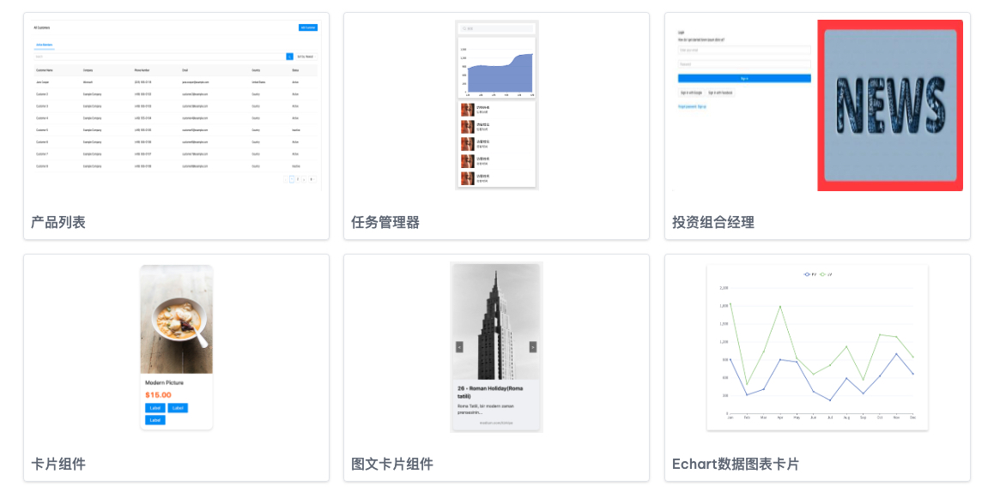

# ScriptEcho 轻松上手AI代码生成

10倍提升页面开发效率，海量的物料，Vue、React、uniapp、Flutter 等各种框架支持

## 功能特性 

### 1、从原型图/设计图/页面描述文字，一键生成代码

您可以通过拖放来修改页面，只需“一键”即可导入演示，还可以修改主题设置和易于使用的选项面板。

### 2、手绘草图，一键生成代码

您可以使用拖放功能修改页面，也可以使用导入演示只是一键点击”，并可以修改主题设置易于使用的选项面板。

### 3、视觉标注，一键修改

您可以通过拖放来修改页面，只需“一键”即可导入演示，还可以修改主题设置和易于使用的选项面板。

## 海量组件，支持查询、下载、嵌入

