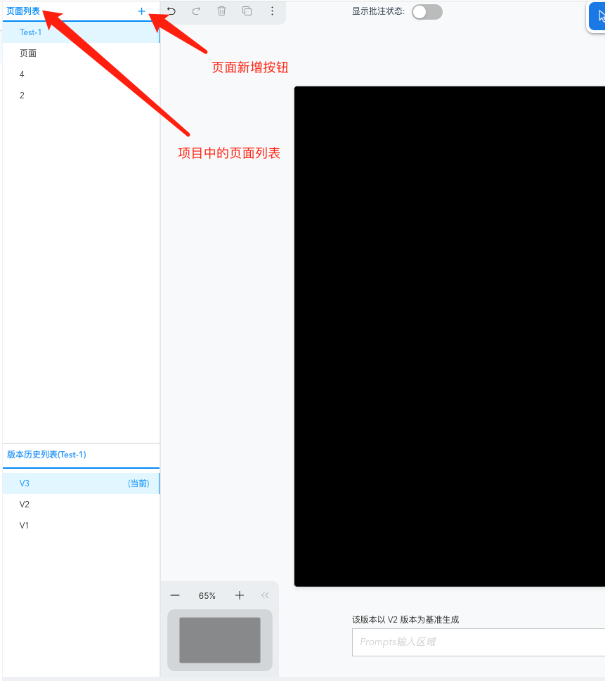
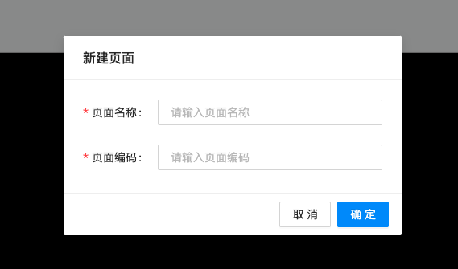
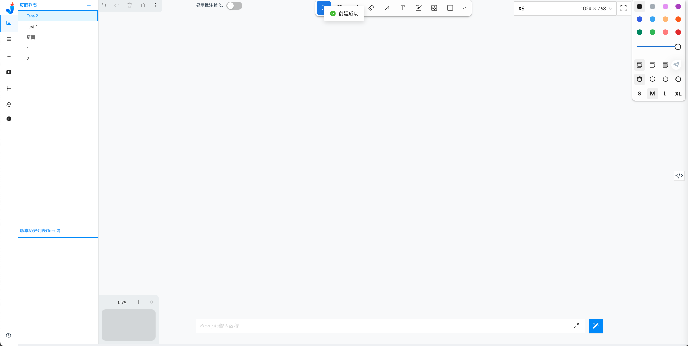

# 如何创建新页面
目前您可以直接在页面中，在固定的某一个项目内新增一个页面
 

<iframe style="width:100%; height:400px;" src="//player.bilibili.com/player.html?aid=1101535207&bvid=BV15w4m1d7wF&cid=1468518648&p=1" scrolling="no" border="0" frameborder="no" framespacing="0" allowfullscreen="true"> </iframe>

在页面左侧，您可以看到由【页面列表】以及【版本历史列表】组成，在上方的【页面列表】中，点击【+】即可新增一个页面。  
ps：目前内测会给您赋予一个项目权限，在这个项目中，您可以随意添加页面，在后续的正式版中，您至少需要拥有该项目的开发权限才可以对项目进行页面的新增操作。

点击【+】后，您可以看到一个新增页面的弹窗，需要在弹窗内输入【页面名称】与【页面编码】，完成输入后，您就会得到一个全新的空页面。

输入限制：
| 页面名称 | 页面编码 |
| ------ | ------ |
| 暂无限制 | 必须为大写驼峰格式，如：TestPage |

 点击确定后，您就完成了新页面的新增，如：
