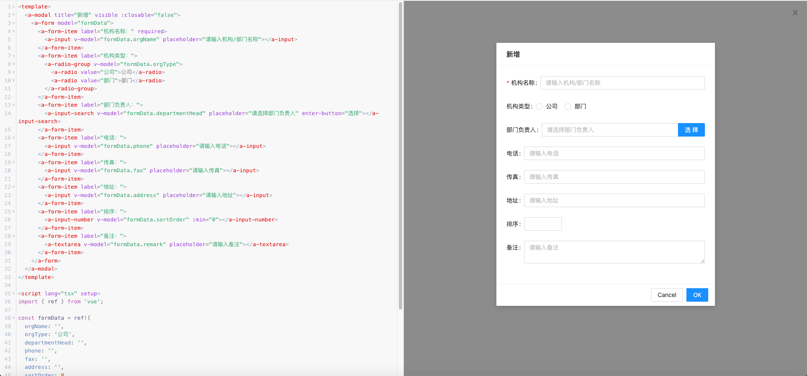

# 代码渲染报错或白屏怎么办？

系统采用了vue/compiler-sfc的Web版本编译器进行编译，报错跟node环境下的vite报错大体一致，但是信息会不太一样。如果发生报错或者白屏，可以打开平台的代码编辑器，修改代码，平台会对修改后的代码进行实时编译。

打开在线代码编辑器：

使用在线代码编辑器：

如果还找不出问题的原因，可以尝试在本地进行编译，具体可以参考[本地编译代码](../local-compile.md)
