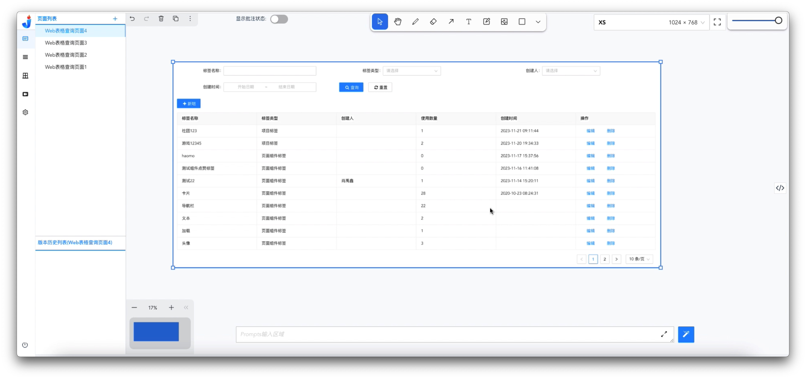
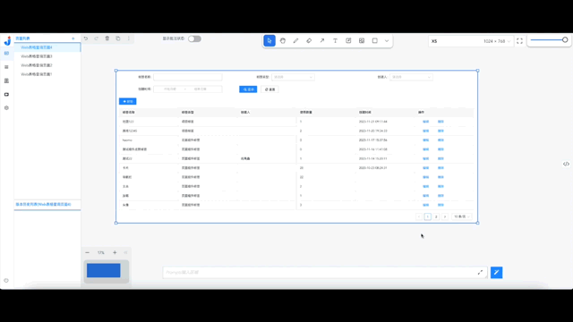
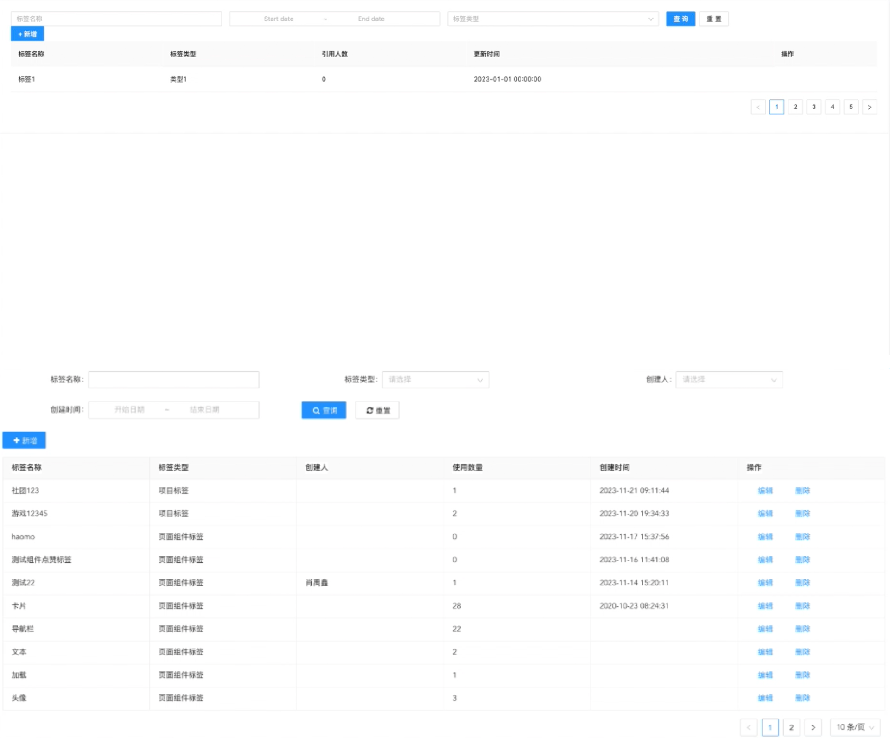
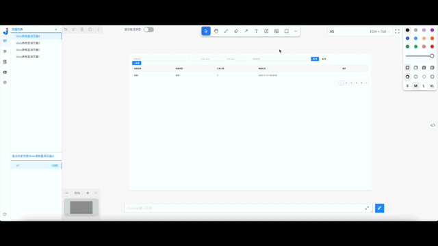
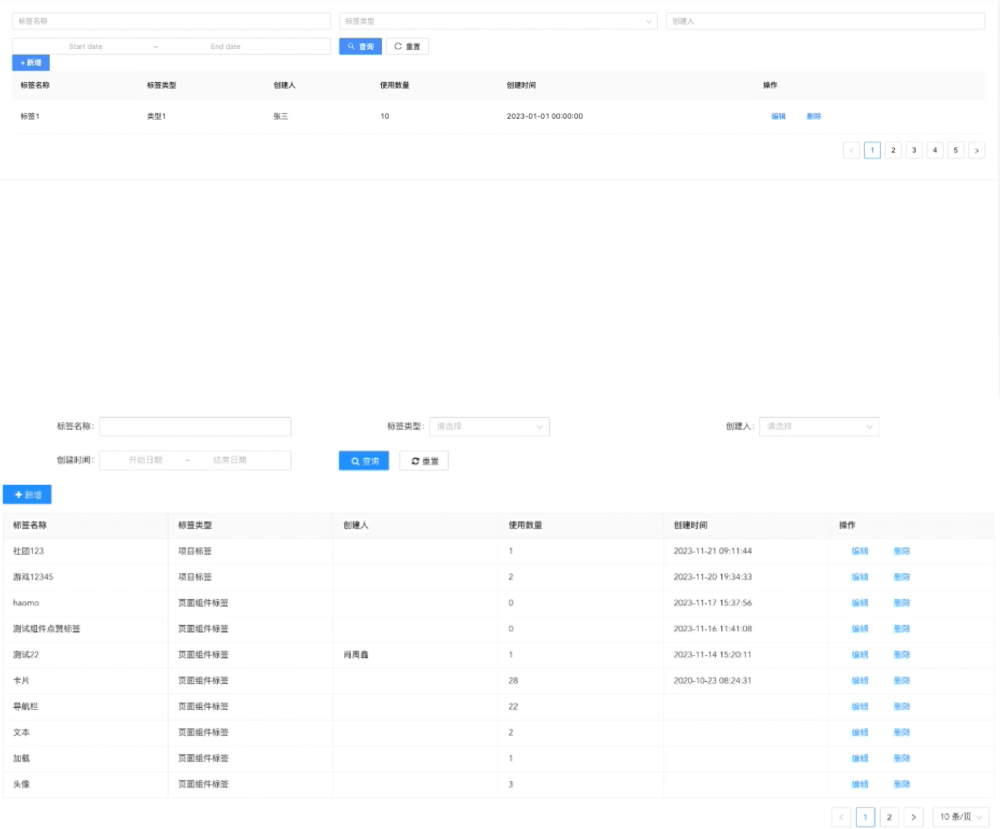

# 生成Web表格查询页面

## 生成目标

## 生成步骤

### 1、生成方式介绍
    该示例先是使用上传原型图的方式进行页面生成，在完成初次页面生成后，再对页面进行批注、修改代码等方式进行微调。
### 2、生成步骤描述
#### 2.1、上传原型图

#### 2.2、页面首次生成

点击【生成按钮】，生成页面，如下：

  
首次生成的页面结果如下：
 <image width=auto height=auto src="./assets/examples/Web/webcrud-2.jpg"/>
  
与原型图的对比：

#### 2.3、页面调整

由于跟原型图仍有较大的差距，因此需要进行页面的调整，如下：

  
首次调整的页面结果如下：
 <image width=auto height=auto src="./assets/examples/Web/webcrud-5.jpg"/>
  
与原型图的对比：

