# 生成Web表单页面

## 生成目标

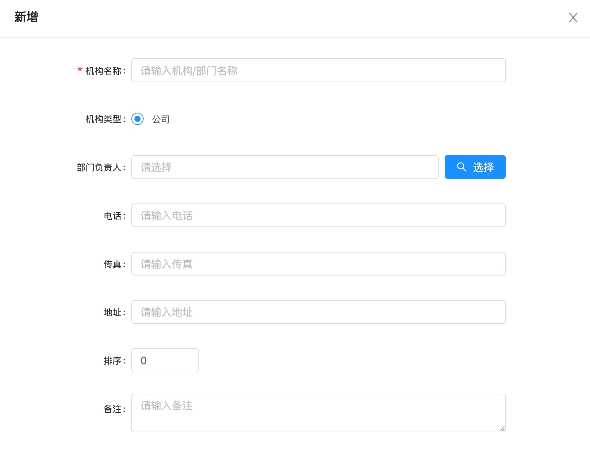

## 生成步骤

### 1、生成方式介绍
    该示例先是使用上传原型图的方式进行页面生成，在完成初次页面生成后，再对页面进行批注、修改代码等方式进行微调。
### 2、生成步骤描述
#### 2.1、上传原型图
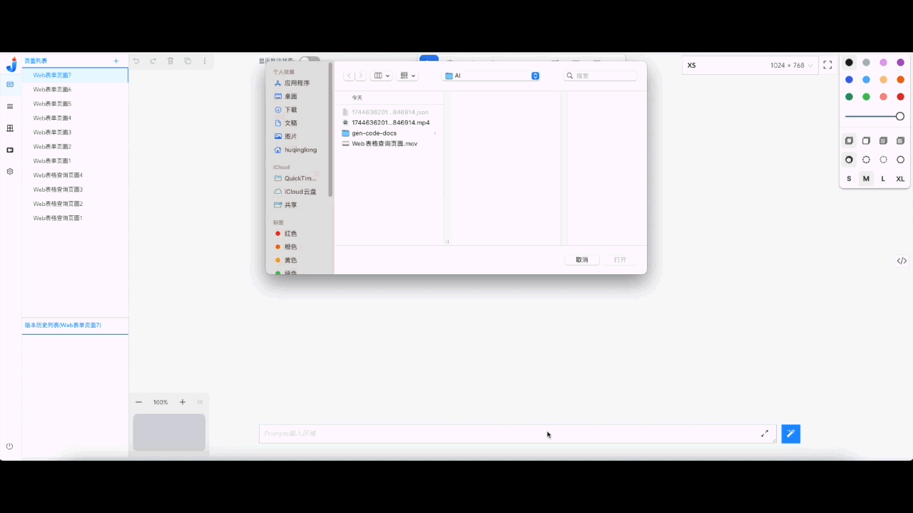
#### 2.2、页面首次生成
在完成原型图的上传后，可见画布中展示如： 

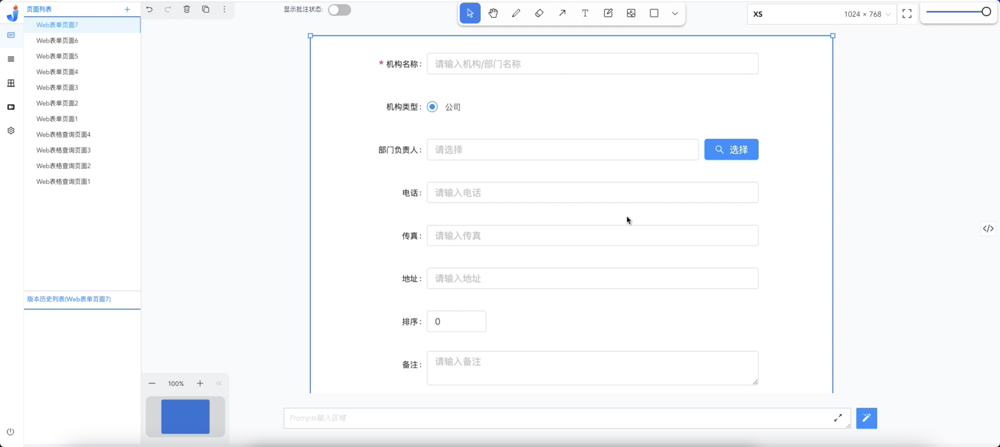
  
点击【生成按钮】，生成页面，如下：
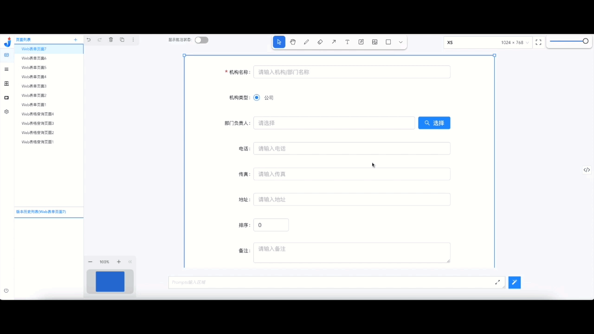
  
首次生成的页面结果如下：
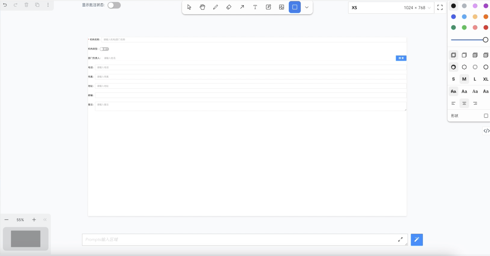
  
与原型图的对比：
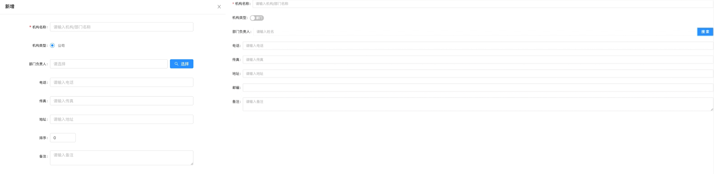

#### 2.3、页面微调
    我们知道，首次生成的结果并不能满足日常的开发需求，因此，我们有了如下的页面调整操作：
* 1. 批注：
     我们对V1.0版本生成的页面进行批注，并且将这些批注发送给大模型，让大模型针对这些批注进行修改，如：
    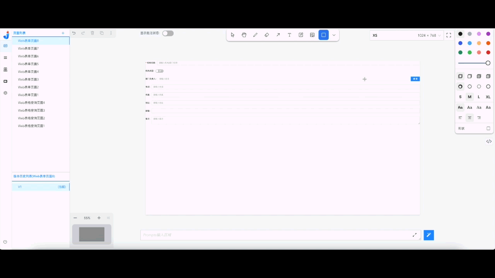
* 2. 提供提示词：
     除添加批注外，我们还对V1.0版本生成的页面，在批注的基础上，添加Prompts提示词，以便大模型能更好地理解我们的开发意图，如：
    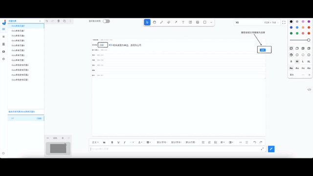

     通过以上两种方式合并使用，我们可以得出以下的页面结果：
    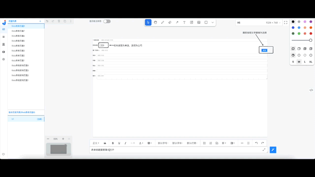
     
    上述可见，生成的V2.0版本产生了白屏bug，这里就需要开发排查生成的页面代码中的一些问题，在FAQ中也会有该类问题的解决方式描述，而该页面中出现的问题为大模型在生成V2.0页面版本代码时，省略了一些代码所导致，因此需要开发手动进行代码的替换修改，也就是从V1.0版本中将被省略的代码补充到V2.0版本，并点击保存修改即可，如：
    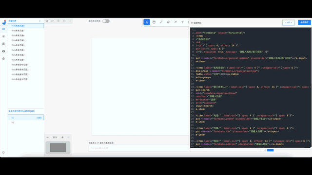
### 3、生成结果
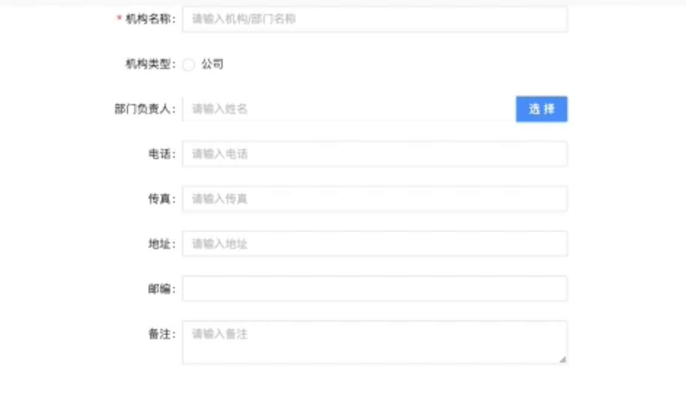