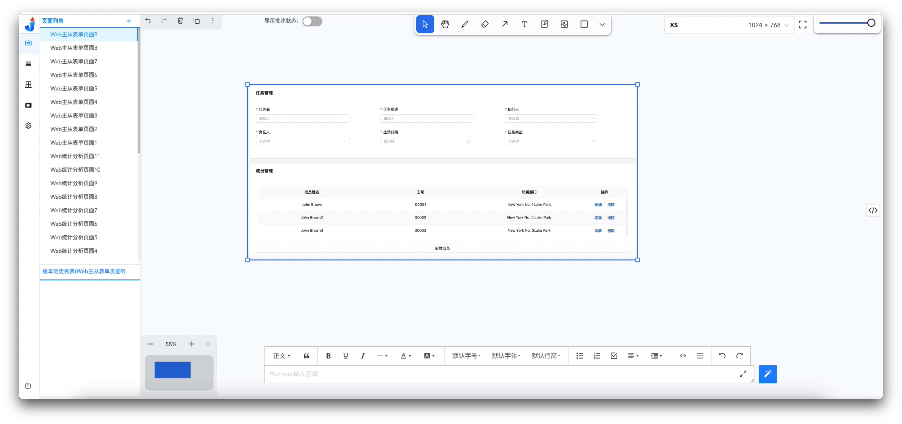
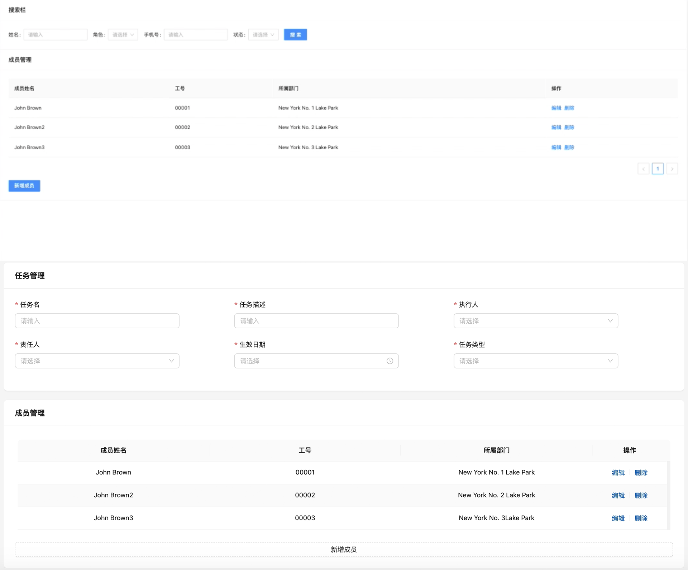

# 生成Web主从表单页面

## 生成目标

## 生成步骤

### 1、生成方式介绍
    该示例先是使用上传原型图的方式进行页面生成，在完成初次页面生成后，再对页面进行批注、修改代码等方式进行微调。
### 2、生成步骤描述
#### 2.1、上传原型图

#### 2.2、页面首次生成
由于该原型图有两个不同类型的分块组合而成，因此，首次生成前添加提示词，如： 
成员管理的内容为表格，底部有新增成员按钮
点击【生成按钮】，生成页面，如下：
<iframe style="width=100%; height=400px" src="//player.bilibili.com/player.html?aid=1451534620&bvid=BV1Ci421d7Tu&cid=1468497221&p=1" scrolling="no" border="0" frameborder="no" framespacing="0" allowfullscreen="true"> </iframe>
  
首次生成的页面结果如下：
 <image width=auto height=auto src="./assets/examples/Web/webdetail-3.jpg"/>
  
与原型图的对比：

#### 2.3、页面调整

由于跟原型图仍有部分的差距，因此需要进行页面的调整，如下：
<iframe style="width=100%; height=400px" src="//player.bilibili.com/player.html?aid=1401507860&bvid=BV1sr421H7VH&cid=1468499320&p=1" scrolling="no" border="0" frameborder="no" framespacing="0" allowfullscreen="true"> </iframe>
  
首次调整的页面结果如下：
 <image width=auto height=auto src="./assets/examples/Web/webdetail-6.jpg"/>
  