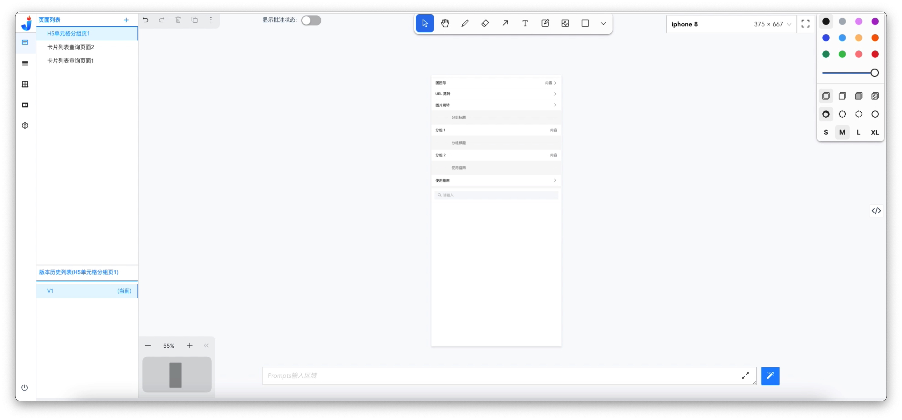
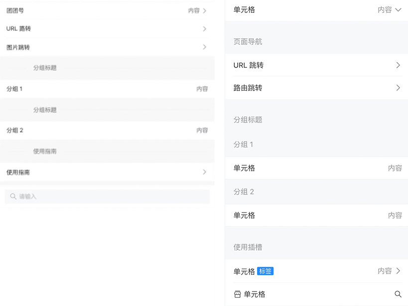

# 生成H5端单元格分组页

## 生成目标

<image width="320px" height=auto src="./assets/examples/MobileH5/单元格分组页.jpeg"/>

## 生成步骤

### 1、生成方式介绍
    该示例先是使用上传原型图的方式进行页面生成，在完成初次页面生成后，再对页面进行批注、修改代码等方式进行微调。
### 2、生成步骤描述
#### 2.1、上传原型图

#### 2.2、页面首次生成

点击【生成按钮】，生成页面，如下：
<iframe style="width:100%; height=400px;" src="//player.bilibili.com/player.html?aid=1251726971&bvid=BV1EJ4m1a7hP&cid=1468511535&p=1" scrolling="no" border="0" frameborder="no" framespacing="0" allowfullscreen="true"> </iframe>
  
首次生成的页面结果如下：
 <image width="320px" height=auto src="./assets/examples/Web/cellgroup-2.jpg"/>
  
与原型图的对比：
