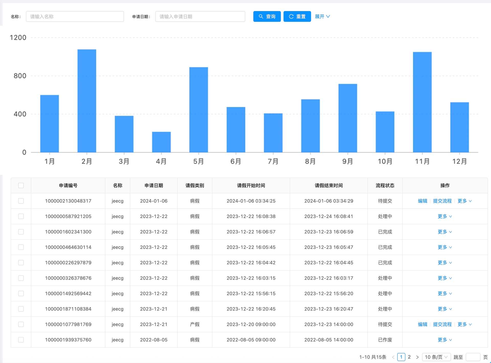

# 生成Web统计分析页面

## 生成目标

## 生成步骤

### 1、生成方式介绍

该示例先是使用上传原型图的方式进行页面生成，在完成初次页面生成后，再对页面进行批注、修改代码等方式进行微调。

### 2、生成步骤描述
#### 2.1、上传原型图

#### 2.2、页面首次生成
输入提示词：底部为表格。
 点击【生成按钮】，生成页面，如下： 
<image src="./assets/examples/Web/webstats-1.gif" style="width:100%">
  
首次生成的页面结果如下：
 <image width=auto height=auto src="./assets/examples/Web/webstats-2.jpg"/>

