# 快速入门

 XXX产品是一款创新的AI驱动工具，能够将您的设计快速转化为前端代码。无论您是设计师、开发者还是产品经理，本手册将指导您迅速上手XXX产品，轻松生成网页原型和前端代码。 

---
### 1、创建一个新页面
目前您可以直接在页面中，在固定的某一个项目内新增一个页面
 

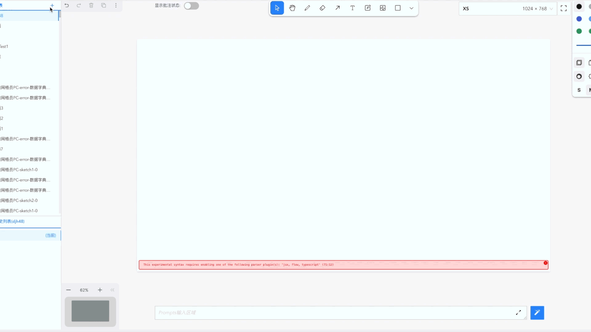
### 2、上传您的创意
#### 2.1、上传原型图
通过以下工具，按照以下步骤，将准备好的原型图文件上传到画布中：
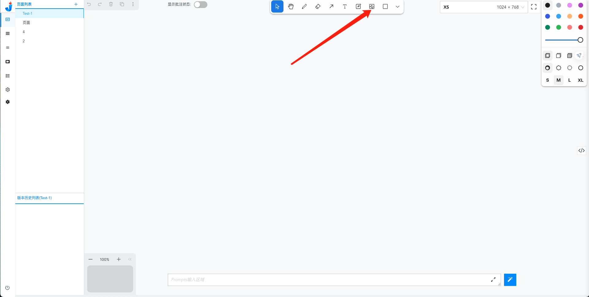

选中您所需要的原型图：
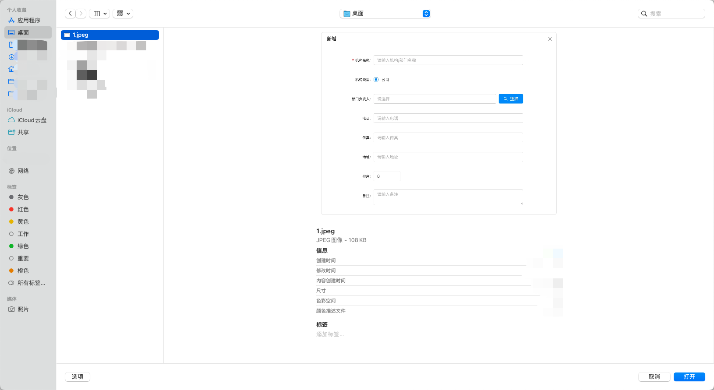

确认上传到画布中如下：
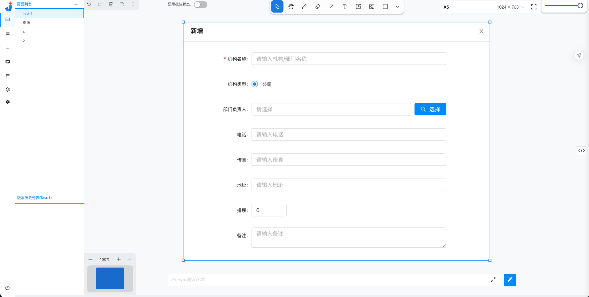

完成原型图的上传后，您也可以在下方的Prompts提示区域输入您的提示词，以便大模型更好的去理解您的原型图以及您的页面生成需求
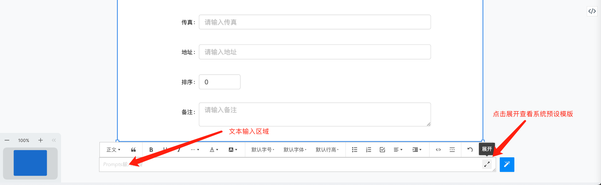

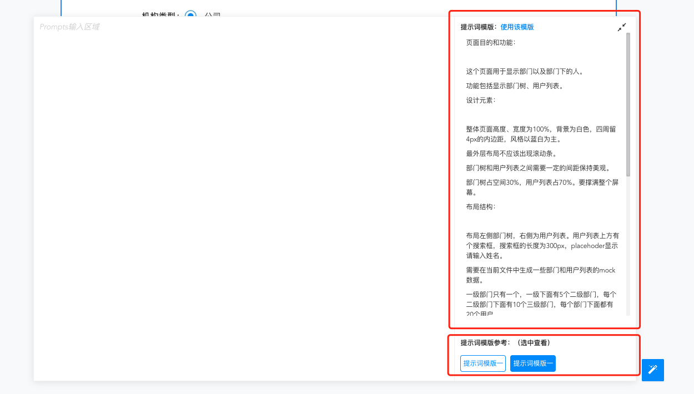

完成上述编辑后，点击提示词右边的生成按钮，等待一下，您的页面即将呈现。
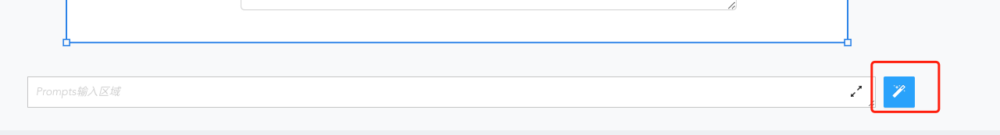
#### 2.2、绘制草图
如果您还没有完整的原型图，也无妨，您还可以直接在画布上绘制简单的草图：
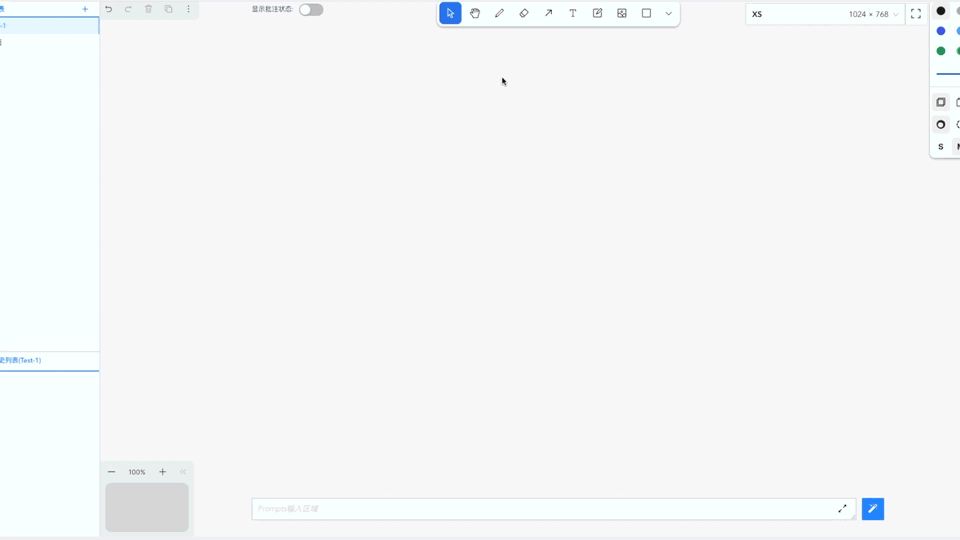

完成草图的绘制后，点击提示词右边的生成按钮，等待一下，您的页面即将呈现。

#### 2.3、文本提示
如果您更擅长文字描述，或者在脑海中已有明确概念，我们也可以直接通过纯文本描述来生成页面。

我们也会持续提供更多不同领域的提示词模版，方便您日后的使用。
### 3、将您的创意转化为页面&代码
不论您通过以上哪一种方式进行描述，最后点击“生成”按钮后，系统都会帮您生成页面预览以及对应的页面代码
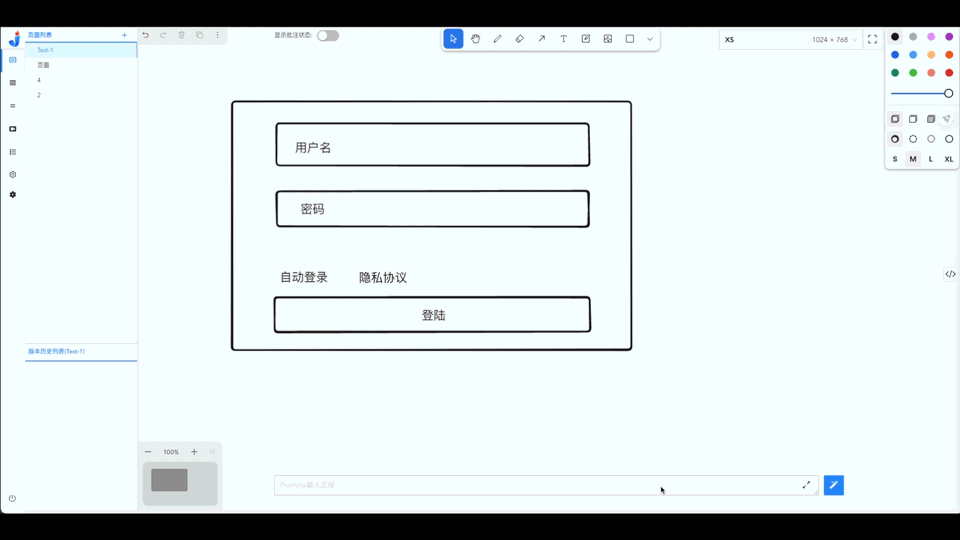
### 4、调整页面/代码
在您完成页面的生成后，您可以通过以下两种方式进行页面的微调：
#### 4.1、对页面进行批注修改
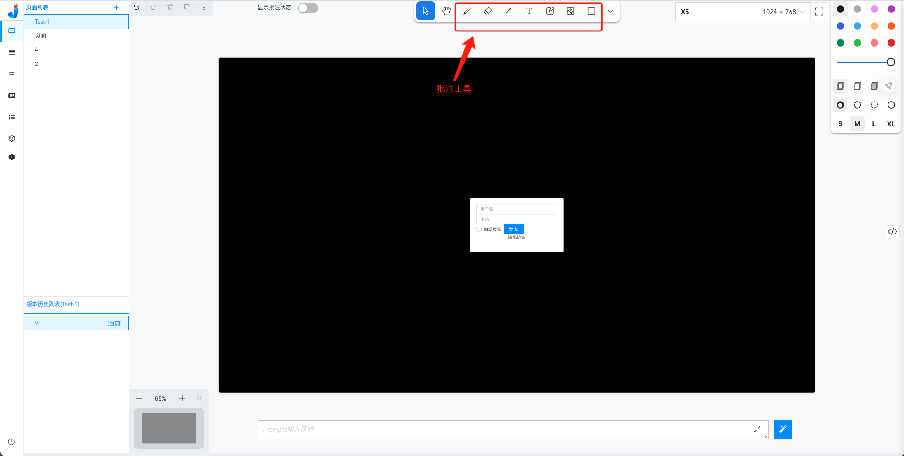
系统提供批注工具让您可以快速对生成后的页面进行批注并根据批注生成新的页面。

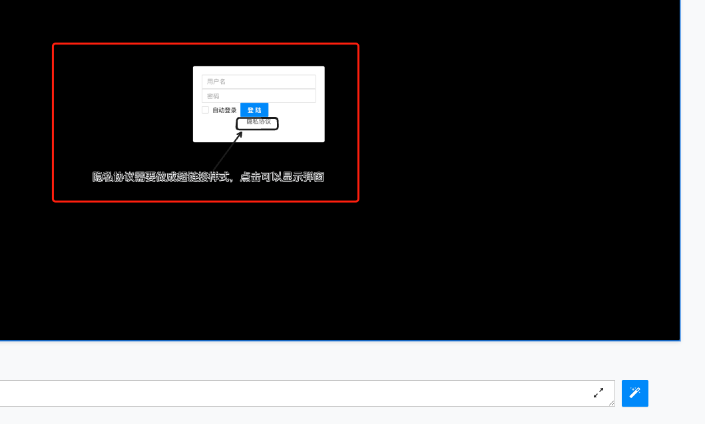
您完成批注后，选中所有对象，点击“生成”，即可针对您的批注进行页面的重新生成。

#### 4.2、手动修改代码
根据上述文档您可以了解到，平台会自动为您生成一份页面代码，如果您是开发，您也可以通过修改页面代码来达到您想要的页面效果。
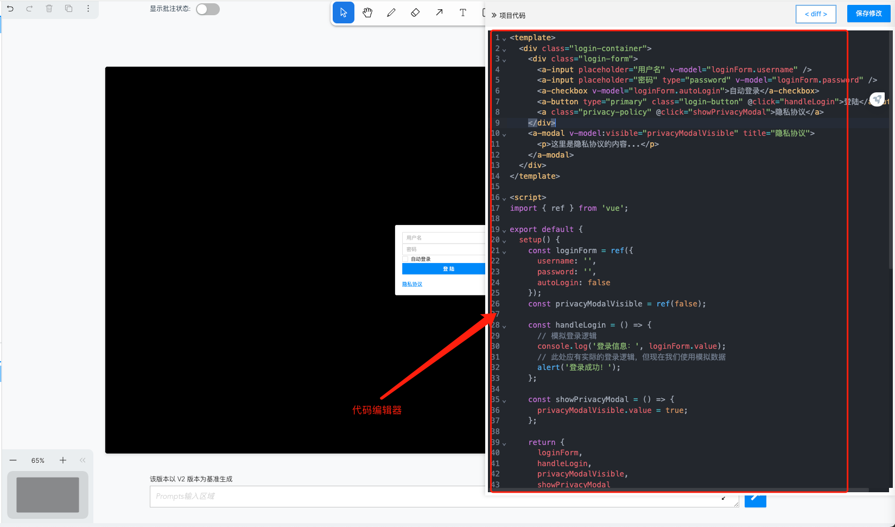