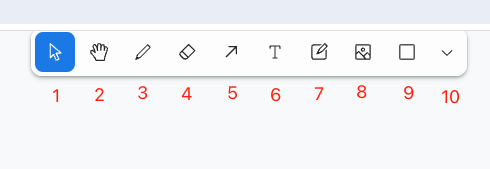
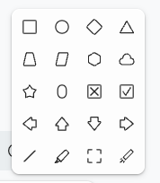

# 如何通过手绘草图生成页面代码
如果您还没有完整的原型图，也无妨，您还可以直接在画布上绘制简单的草图：

其中，您需要使用系统预设的手绘工具： 

 工具详解： 
1. 选择工具：
    选择画布中的所有元素，允许用户快速“画”出想要的选区。
2. 抓手工具：
    用于在画布上拖动视图，方便查看图像的不同部分。
3. 画笔工具：
    用于在图像上绘制笔触。
4. 橡皮擦工具：
    擦除图像上的内容。
5. 箭头工具：
    绘制一个单向箭头。
6. 文字工具：
    用于在图像上添加文本。
7. 便签工具：
    添加一个便签，可以在便签内编辑文本。
8. 图片上传工具：
    上传一张图片。
9. 矩形工具：
    绘制矩形和正方形。
10. 更多：
    您可以看到更多图形的操作工具。 
    

完成草图的绘制后，点击提示词右边的生成按钮，等待一下，您的页面即将呈现。