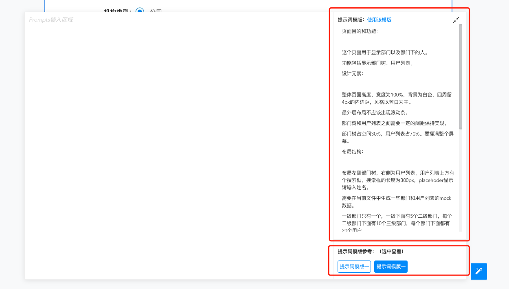

# 如何通过上传原型生成页面代码

## 1. 上传图片
通过以下工具，按照以下步骤，将准备好的原型图文件上传到画布中：

 
选中您所需要的原型图：

 

确认上传到画布中如下：

## 2. 图片处理

完成原型图的上传后，您也可以在下方的Prompts提示区域输入您的提示词，以便大模型更好的去理解您的原型图以及您的页面生成需求

 

## 3. 生成页面

完成上述编辑后，点击提示词右边的生成按钮，等待一下，您的页面即将呈现:

 

<iframe style="width:100%;height:400px;" src="//player.bilibili.com/player.html?aid=1701696410&bvid=BV1jK421x7uL&cid=1468839853&p=1" scrolling="no" border="0" frameborder="no" framespacing="0" allowfullscreen="true"> </iframe> 